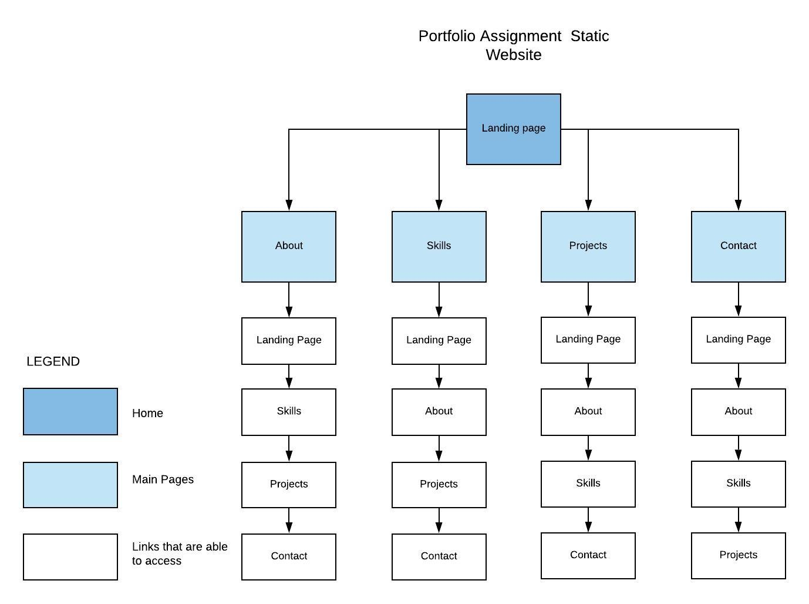
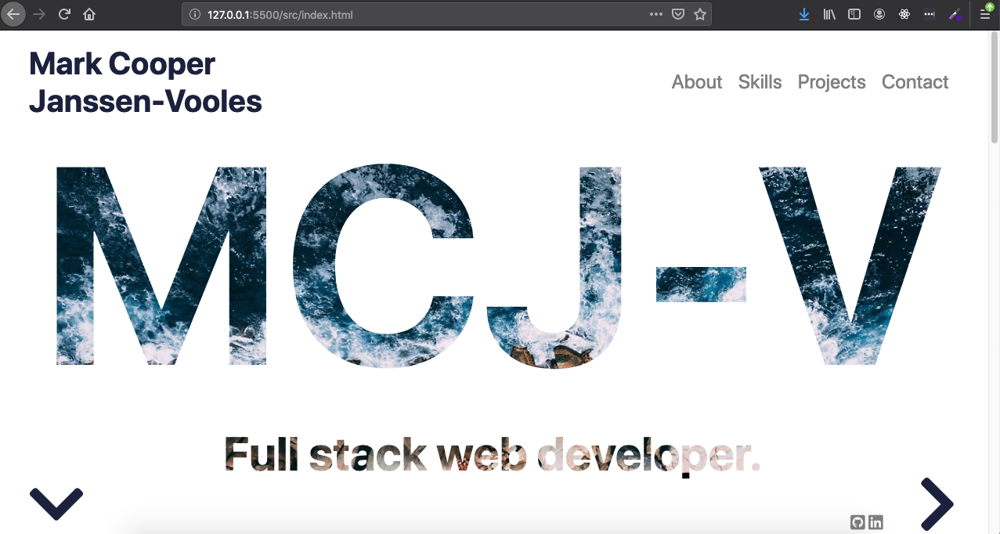
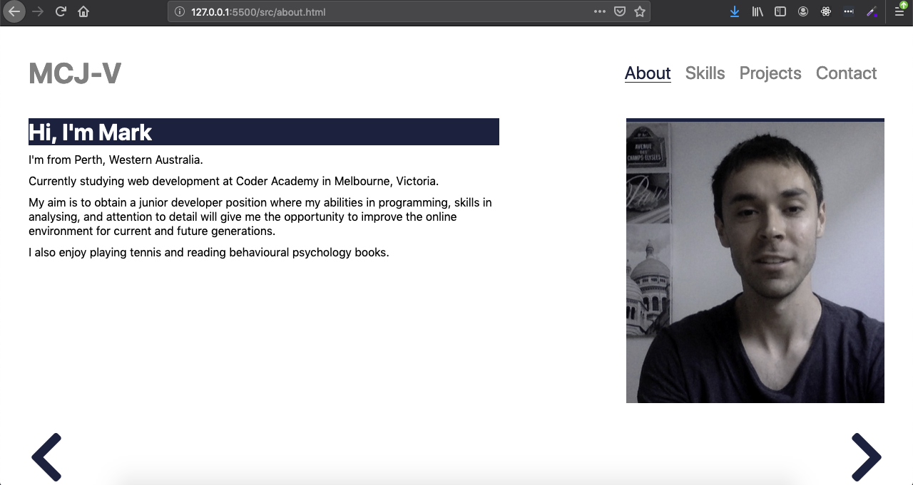
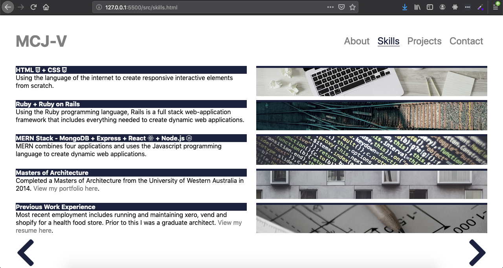
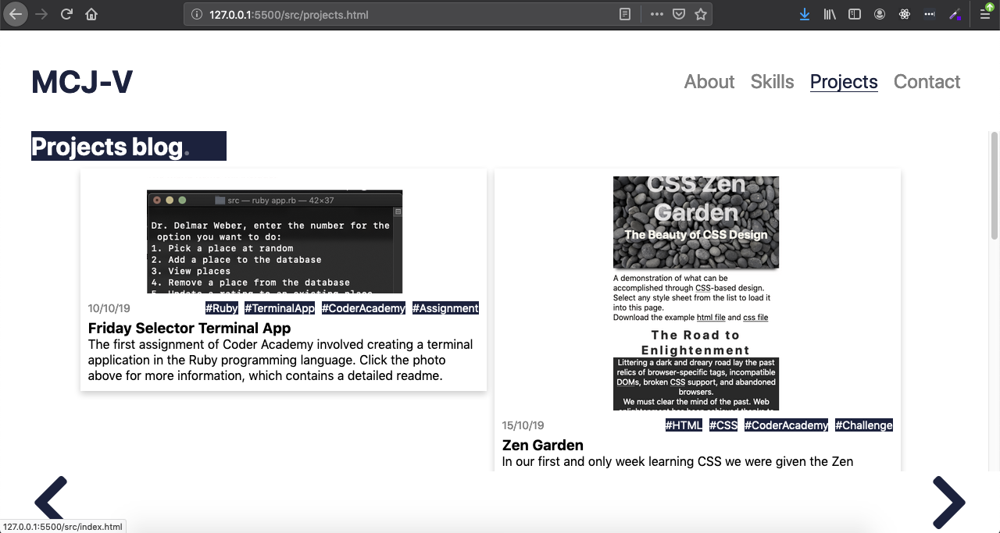
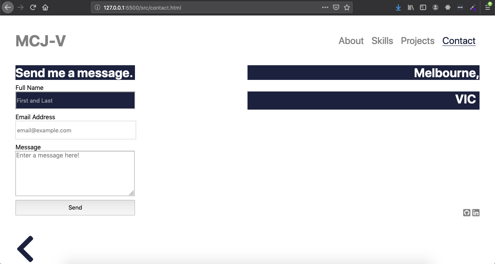

### Portfolio Assignment

[The website for my portfolio can be found here](https://markcooperjanssen-vooles.netlify.com/ "Portfolio Assignment Link")

[The GitHub repository can be found here](https://github.com/Mark-Cooper-Janssen-Vooles/02_portfolio_site "GitHub repository Link")

**Description:** The purpose of this portfolio website was to test our ability to write static HTML and CSS websites after one week of being taught about these markdown languages. 

**Target Audience:** The website has been aimed at potential employers, and written as a sort of resume-style. 

**The site has 5 pages: a landing, an about, a skills, a projects and a contact page.**
* The landing page uses a parallax scrolling effect, with a brief background story. 
* The about page contains information about my current activities, aims for the future and hobbies, as well as a photo. 
* The skills page has a list of skills, study experience and work experience. 
* The projects page has been done in a blog-card format with information on some projects i've completed, including the date, relevant tags, and a link to the github repository of each one. 
* The contact page has a form which utilizies formspree's service as its backend.  

## Sitemap
The user will land on the home page, and be presented with a navbar to go to the other pages. There will also be a footer: on the home page there will be a down link which takes you into a parallax scrolling story, or a right pointing arrow that will take you to the about page (the next one in the navbar). If you choose to scroll through the parallax story, at the bottom there will be an arrow which takes you back to the top of the page. 

On the about page the navbar stays the same, but the "about" link is colored and underlined to signify to the user that they are on that page. In the footer, you can go left (back to home) or right (to skills).

In the skills page, the navbar has the same feature that highlights the current page. The arrows in the footer go left (back to about) or right (to projects).

In the projects page, the navbar has the same feature that highlights the current page. The arrows in the footer go left (back to skills) or right (to contact).

In the contact page, the navbar has the same feature that highlights the current page. The arrows in the footer go left (back to projects).

## Screenshots 

**Home**

**About**

**Skills**

**Projects**

**Contact**

## Tech Stack:
* HTML
* CSS
* Netlify