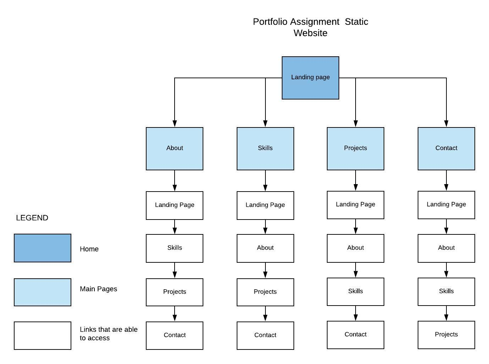

### Portfolio Assignment

[The website for my portfolio can be found here](https://markcooperjanssen-vooles.netlify.com/ "Portfolio Assignment Link")

[The GitHub repository can be found here](https://github.com/Mark-Cooper-Janssen-Vooles/02_portfolio_site "GitHub repository Link")

## Description 

The purpose of this portfolio website was to test our ability to write static HTML and CSS websites after one week of being taught about these markdown languages. It has been aimed at potential employers, and written as a resume-style website. 

**The site has 5 pages: a landing, an about, a skills, a projects and a contact page.**
* The landing page uses a parallax scrolling effect, with a brief background story. 
* The about page contains information about my current activities, aims for the future and hobbies, as well as a photo. 
* The skills page has a list of skills, study experience and work experience. 
* The projects page has been done in a blog-card format with information on some projects i've completed, including the date, relevant tags, and a link to the github repository of each one. 
* The contact page has a form which utilizies formspree's service as its backend.  

        Screenshots
        Target audience
        Tech stack (e.g. html, css, deployment platform, etc)

